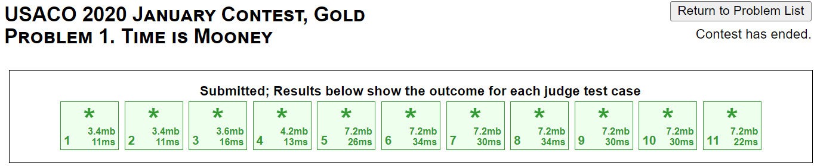
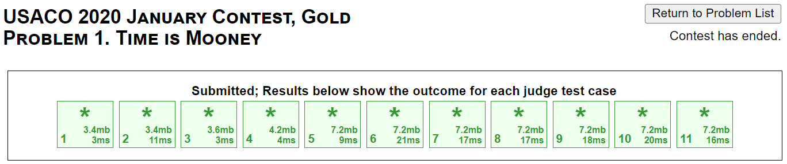

# USACO 2020 January Contest, Gold
## Problem 1. Time is Mooney

http://www.usaco.org/index.php?page=viewproblem2&cpid=993

### Problem Statement

Bessie is conducting a business trip in Bovinia, where there are `N` `(2 <= N <= 1000)` cities labeled `1...N`
connected by `M` `(1 <= M <= 2000)` one-way roads. Every time Bessie visits city `i`,
Bessie earns `mi` moonies `(0 <= mi <= 1000)`. Starting at city 1 Bessie wants to visit cities to make as much mooney as she can, ending back at city 1. To avoid confusion, `m1 = 0`.

Mooving between two cities via a road takes one day. Preparing for the trip is expensive; it costs `C * T^2`
moonies to travel for `T` days `(1 <= C <= 1000)`.

What is the maximum amount of moonies Bessie can make in one trip? Note that it may be optimal for Bessie to visit no cities aside from city 1, in which case the answer would be zero.

### Input Format (file time.in):

- The first line contains three integers `N`, `M`, and `C`.
- The second line contains the `N` integers `m1, m2,...,mN`.

The next `M` lines each contain two space-separated integers `a` and `b (a != b)` denoting a one-way road from city `a` to city `b`.

### Output Format (file time.out):

A single line with the answer.

### Sample Input

```
3 3 1
0 10 20
1 2
2 3
3 1
```

### Sample Output

```
24
```

The optimal trip is `1 -> 2 -> 3 -> 1 -> 2 -> 3 -> 1`.  
Bessie makes `10 + 20 + 10 + 20 - 1 * 6^2 = 24` moonies in total.

### Hints:
- Use at least a 2-D DP array along with other variables to keep track of the state of the problem.
- Create an adjacency list to store the one-way roads between cities.
- Optional: Think of ways to optimize runtime by telling the program to stop early if the journey becomes unprofitable.

# 2-D Dynamic Programming + Graph Traversal Solution

https://github.com/Reddimus/USACO_notes/tree/main/Multi-D_Dynamic_Programming/Gold/P1_2020-Time_Is_Mooney

### Intuition:
 The foundational intuition for developing this solution lies in recognizing that the problem can be modeled as a graph traversal task augmented with a stateful dynamic programming (DP) approach. Each city is essentially a node in a graph, and the one-way roads between them serve as directed edges. While it's tempting to consider greedy approaches, like always moving to the city with the highest immediate profit, the quadratic cost function over time complicates matters. It introduces a need for a more global optimization strategy—hence the use of DP. The DP table, `dp[day][city]`, was conceptualized to store the maximum money that can be accumulated on a given day if we end in a particular city. This offers a systematic way to update the money earned when moving from one city to another across days. The early termination condition stems from the observation that the quadratic cost function will eventually outweigh any gains, turning the journey unprofitable. By capturing these insights into a DP table while traversing the graph, we can efficiently find the path that maximizes the money earned while accounting for the increasing cost over time.

### Steps:
1. Read in the input file and store the number of cities (`n`), number of one-way roads (`m`), and cost multiplier (`c`).
2. Read in the moonies earned in each city and store them in an array (`moonies`), where the index represents the city number.
3. Create an adjacency list (`adj`) to store the one-way roads between cities. The index represents the city number, and the values represent the cities it connects to.
4. Initialize all of the DP table (`dp`) values to `-1` which represents the current node/city is unreachable. The DP table is a 2-D array with dimensions `maxDays` by `n`, where `maxDays` is the maximum number of days Bessie can travel. The base case is `dp[0][0] = 0` because Bessie starts at city 1 with no money.
5. For each day, update the DP table with the maximum money that can be accumulated on a given day if we end in a particular city. This is done by iterating through each city and checking if it is reachable on the current day. If it is reachable, then we iterate through each city it connects to and update the DP table with the maximum money that can be accumulated on the next day if we end in that city. This is done by taking the maximum of the current value in the DP table and the money earned in the current city plus the money earned in the next city. 
6. After updating the DP table, check if the current city is city 1. If it is, then we can calculate the maximum money that can be accumulated on the current day if we end in city 1. This is done by subtracting the cost of traveling from the current day squared from the money earned in city 1. If the maximum money that can be accumulated on the current day if we end in city 1 is negative, then we break out of the loop because the cost of traveling will eventually outweigh any gains, turning the journey unprofitable. Otherwise, we update the maximum money that can be accumulated on the current day if we end in city 1.
7. After iterating through all of the days, write the maximum money that can be accumulated on the current day if we end in city 1 to the output file.

### Time & Space complexity:
**Time:** `O(maxDays * n * m)`  
**Space:** `O(maxDays * n)`

Where `n` is the number of cities, `m` is the number of one way roads, and `maxDays` is the maximum number of days Bessie can travel.

### C++ Code:
```cpp
#define MAX_DAYS 1000

#include <bits/stdc++.h>

using namespace std;

int main() {
	freopen("time.in", "r", stdin);
	// First line: n = num cities, m = num of one way roads, c = cost multiplier
	int n, m, c;
	cin >> n >> m >> c;

    // Second line: moonies[i] = moonies earned in city i
	int moonies[n];
	for (int cityIdx = 0; cityIdx < n; ++cityIdx)
		cin >> moonies[cityIdx];

	// For the next m lines create adjacency list for one way roads between cities
	// index = city, value(s) = cities it connects to
	vector<vector<int>> adj(n);
	for (int ln = 0; ln < m; ++ln) {
		int cityA, cityB;
		cin >> cityA >> cityB;
		adj[--cityA].push_back(--cityB);
	}

    // dp[day][city], where maxDays = 1000
	vector<vector<int>> dp(MAX_DAYS + 1, vector<int>(n, -1));
	dp[0][0] = 0;   // base case

	// For each day, stockpile moonies in each city visited using one way roads
	int maxMoony = 0;
	for (int day = 0; day < MAX_DAYS; ++day) {
		for (int city = 0; city < n; ++city) {
			// if dp[day][city] is -1, then there is no path to that city
			if (dp[day][city] != -1) {
				for (int nextCity : adj[city])
					dp[day + 1][nextCity] = max(dp[day + 1][nextCity], dp[day][city] + moonies[nextCity]);
			}
		}
		
		// We are only looking for maxMoony that loops back to city 1
		if (dp[day][0] != -1) {
			int tempMoony = dp[day][0] - (c * day * day);
			// If all potential maxMoony values have been calculated, break
			if (tempMoony < 0 && maxMoony != 0)
				break;
			maxMoony = max(maxMoony, tempMoony);
		}
	}

	// Write maxMoony generated from visiting cities to output file
	freopen("time.out", "w", stdout);
	cout << maxMoony << endl;
}
```

### Java Code:
```java
import java.io.*;
import java.util.*;

public class Mooney {
	public static void main(String[] args) throws IOException {
		BufferedReader in = new BufferedReader(new FileReader("time.in"));

		// First line: n = num cities, m = num of one way roads, c = cost multiplier
		StringTokenizer st = new StringTokenizer(in.readLine());
		int n = Integer.parseInt(st.nextToken());
		int m = Integer.parseInt(st.nextToken());
		int c = Integer.parseInt(st.nextToken());

		// Second line: moonies[i] = moonies earned in city i
		int[] moonies = new int[n];
		st = new StringTokenizer(in.readLine());
		for (int cityIdx = 0; cityIdx < n; ++cityIdx)
			moonies[cityIdx] = Integer.parseInt(st.nextToken());

		// For the next m lines create adjacency list for one way roads between cities
		// index = city, value(s) = cities it connects to
		ArrayList<ArrayList<Integer>> adj = new ArrayList<>();
		for (int cityIdx = 0; cityIdx < n; ++cityIdx)
			adj.add(new ArrayList<Integer>());
		for (int ln = 0; ln < m; ++ln) {
			st = new StringTokenizer(in.readLine());
			int city1 = Integer.parseInt(st.nextToken()) - 1;
			int city2 = Integer.parseInt(st.nextToken()) - 1;
			adj.get(city1).add(city2);
		}
		in.close();

		// dp[day][city], where maxDays = 1000
		int dp[][] = new int[1001][n];
		for (int[] row : dp)
			Arrays.fill(row, -1);
		dp[0][0] = 0;	// base case
		
		// For each day, stockpile moonies in each city visited using one way roads
		int maxMoony = 0;
		for (int day = 0; day <= 1000; ++day) {
			for (int city = 0; city < n; ++city) {
				if (dp[day][city] != -1) {
					for (int nextCity : adj.get(city))
						dp[day+1][nextCity] = Math.max(dp[day+1][nextCity], dp[day][city] + moonies[nextCity]);
				}
			}

			// We are only looking for maxMoony that loops back to city 1
			if (dp[day][0] != -1) {
				int tempMoony = dp[day][0] - (c * day * day);
				// If all potential maxMoony values have been calculated, break
				if (tempMoony < 0 && maxMoony != 0)
					break;
				maxMoony = Math.max(maxMoony, tempMoony);
			}
		}

		// Write maxMoony generated from visiting cities to output file
		PrintWriter out = new PrintWriter("time.out");
		out.println(maxMoony);
		out.close();
	}
}
```

### Slight Optimization:
In the given solution I found a way to tell the algorithm to stop once the journey becomes unprofitable. This is done by checking if the maximum money that can be accumulated on the current day if we end in city 1 is negative. If it is, then we break out of the loop because the cost of traveling will eventually outweigh any gains, turning the journey unprofitable. This optimization is not necessary to pass the test cases, but it does improve the runtime of the algorithm.

Referenced code:

C++:
```cpp
// We are only looking for maxMoony that loops back to city 1
if (dp[day][0] != -1) {
	int tempMoony = dp[day][0] - (c * day * day);
	// If all potential maxMoony values have been calculated, break
	if (tempMoony < 0 && maxMoony != 0)
		break;
	maxMoony = max(maxMoony, tempMoony);
}
```
Java:
```java
// We are only looking for maxMoony that loops back to city 1
if (dp[day][0] != -1) {
	int tempMoony = dp[day][0] - (c * day * day);
	// If all potential maxMoony values have been calculated, break
	if (tempMoony < 0 && maxMoony != 0)
		break;
	maxMoony = Math.max(maxMoony, tempMoony);
}
```


**Without optimization (C++):**


**With optimization (C++):**
