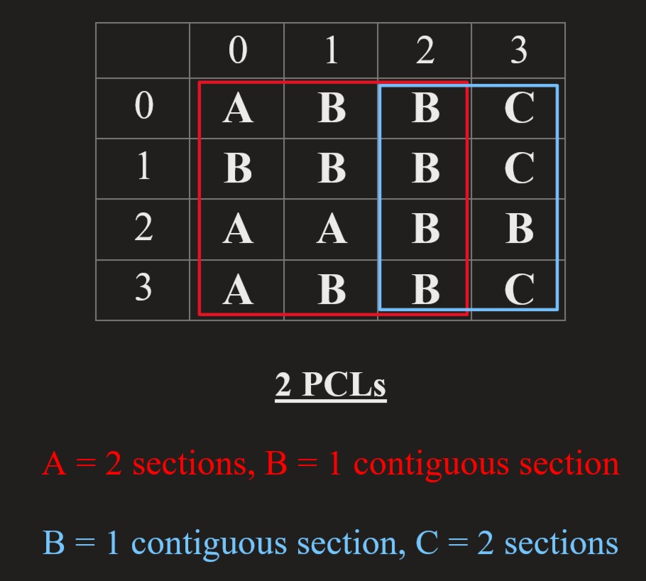

# [USACO 2017 US Open Contest, Silver](http://www.usaco.org/index.php?page=open17results)
## [Problem 3. Where's Bessie?](http://www.usaco.org/index.php?page=viewproblem2&cpid=740)

Always known for being quite tech-savy, Farmer John is testing out his new automated drone-mounted cow locator camera, which supposedly can take a picture of his field and automatically figure out the location of cows. Unfortunately, the camera does not include a very good algorithm for finding cows, so FJ needs your help developing a better one.

The overhead image of his farm taken by the camera is described by an `N×N` grid of characters, each in the range `A…Z`, representing one of 26 possible colors. Farmer John figures the best way to define a potential cow location (PCL) is as follows: A PCL is a rectangular sub-grid (possibly the entire image) with sides parallel to the image sides, not contained within any other PCL (so no smaller subset of a PCL is also a PCL). Furthermore, a PCL must satisfy the following property: focusing on just the contents of the rectangle and ignoring the rest of the image, exactly two colors must be present, one forming a contiguous region and one forming two or more contiguous regions.

For example, a rectangle with contents

```
AAAAA
ABABA
AAABB
```

would constitute a PCL, since the A's form a single contiguous region and the B's form more than one contiguous region. The interpretation is a cow of color A with spots of color B.

A region is "contiguous" if you can traverse the entire region by moving repeatedly from one cell in the region to another cell in the region taking steps up, down, left, or right.

Given the image returned by FJ's camera, please count the number of PCLs.

### INPUT FORMAT (file where.in):

The first line of input contains `N`, the size of the grid `(1≤N≤20)`. The next `N` lines describe the image, each consisting of `N` characters.

### OUTPUT FORMAT (file where.out):

Print a count of the number of PCLs in the image.

### SAMPLE INPUT:

```
4
ABBC
BBBC
AABB
ABBC
```

### SAMPLE OUTPUT:

```
2
```

In this example, the two PCLs are the rectangles with contents

```
ABB
BBB
AAB
ABB
```

and

```
BC
BC
BB
BC
```

### Hint:
-  Your solution can be up to ~`O(N^6)` in time complexity.

# [Solutions](https://github.com/Reddimus/USACO_notes/tree/main/Graphs/Silver/P3_2017-Wheres_Bessie)

## Matrix graphs - Depth-first search/Flood-fill approach

### Intuition
Finding valid potential cow locations (PCLs) is no easy task as a valid PCL must satisfy the following properties:

- Cannot have another PCL inside it
- Must contain exactly two colors, one forming a contiguous region and one forming two or more contiguous regions.

So lets take a step back and look at our sample case:



In our red marked PCL that is `3 x 4` in size, we can see many smaller PCLs inside it. So we can think of solving this problem the brute force approach. Which is to find every possible overlapping PCL. Then we can filter out the overlapping PCLs and count the number of valid PCLs.

### Steps
1. **Read in input data:**
    - First line: `n` = side length of the `N x N` image
    - Next `n` lines: read in image descriptions into a 2D array of characters.
2. **Brute force every sub rectangle to find PCLs:**
    - For every possible sub rectangle of the image, we can check if it is a PCL; this requires a quadruple nested loop.
        - For each sub rectangle, we can check if it is a PCL by using a flood fill algorithm to find the number of color components within the sub rectangle.
3. **Filter out overlapping PCLs & count the number of valid PCLs:**
    - We can filter out overlapping PCLs by checking if one PCL is inside another PCL.
    - We can count the number of valid PCLs by counting the number of PCLs that are not inside another PCL.
    - **Finally, we can output the number of valid PCLs.**

### Time & Space complexity:
Time: *`O(N^6 + |PCLs|^2)`*  
Space: *`O(N^2)`*  

Where `N` is the side length of the `N x N` image and `|PCLs|` is the number of potential cow locations.

## C++ Code:
```cpp
#include <bits/stdc++.h>

using namespace std;

#define NMAX 20

int n;
char image[NMAX][NMAX];

struct PCL {
	int r1, c1;
	int r2, c2;

	bool is_inside(PCL other) {
		return r1 >= other.r1 && c1 >= other.c1 && r2 <= other.r2 && c2 <= other.c2;
	}
};

// Check wheter the given sub rectangle is a PCL
bool is_pcl(int rMin, int cMin, int rMax, int cMax) {
	// keep track of number of color components
	int regionCount[26] = {0};

	bool visited[NMAX][NMAX] = {false};
	// Depth first search common color within sub rectangle boundaries
	function<void(int, int, char)> floodfill = [&](int r, int c, char color) {
		if (r < rMin || r > rMax || 
		c < cMin || c > cMax || 
		image[r][c] != color || 
		visited[r][c])
			return;
		
		visited[r][c] = true;
		
		floodfill(r + 1, c, color);
		floodfill(r - 1, c, color);
		floodfill(r, c + 1, color);
		floodfill(r, c - 1, color);
	};
	
	// Within the sub rectangle, flood fill each color component
	for (int r = rMin; r <= rMax; ++r) {
		for (int c = cMin; c <= cMax; ++c) {
			if (!visited[r][c]) {
				char color = image[r][c];
				floodfill(r, c, color);
				++regionCount[color - 'A'];
			}
		}
	}

	// Determine if the sub rectangle is a PCL
	int colorCount = 0;
	bool singleRegion = false, multiRegion = false;
	for (int i = 0; i < 26 && colorCount <= 2; ++i) {
		if (regionCount[i] == 0)
			continue;
		
		if (regionCount[i] == 1)
			singleRegion = true;
		else if (regionCount[i] > 1)
			multiRegion = true;
		++colorCount;
	}
	return colorCount == 2 && singleRegion && multiRegion;
}

int main() {
	freopen("where.in", "r", stdin);
	// Read first line: n = side length of the N x N image
	cin >> n;
	// For the next N lines read in image descriptions
	for (int r = 0; r < n; ++r) 
		for (int c = 0; c < n; ++c) 
			cin >> image[r][c];

	// Brute force every sub rectangle to find PCLs
	vector<PCL> pcls;
	for (int r1 = 0; r1 < n; ++r1) 
		for (int c1 = 0; c1 < n; ++c1) 
			for (int r2 = r1; r2 < n; ++r2) 
				for (int c2 = c1; c2 < n; ++c2) 
					if (is_pcl(r1, c1, r2, c2)) 
						pcls.push_back({r1, c1, r2, c2});

	// Filter out overlapping PCLs & count the number of valid PCLs
	int pclCount = 0;
	for (int i = 0; i < pcls.size(); ++i) {
		bool validPCL = true;
		for (int j = 0; j < pcls.size(); ++j) {
			if (i != j && pcls[i].is_inside(pcls[j])) {
				validPCL = false;
				break;
			}
		}
		pclCount += validPCL;
	}

	freopen("where.out", "w", stdout);
	cout << pclCount << endl;
	return 0;
}
```

## Java Code:
```java
import java.io.*;
import java.util.*;

class PCL {
	public int r1, c1;
	public int r2, c2;

	public PCL(int r1, int c1, int r2, int c2) {
		this.r1 = r1;
		this.c1 = c1;
		this.r2 = r2;
		this.c2 = c2;
	}

	public boolean isInside(PCL other) {
		return r1 >= other.r1 && c1 >= other.c1 && r2 <= other.r2 && c2 <= other.c2;
	}
}

public class WheresBessie {
	private static int n;
	private static char[][] image;
	public static void main(String[] args) throws IOException {
		BufferedReader in = new BufferedReader(new FileReader("where.in"));
		// Read first line: n = side length of the N x N image
		n = Integer.parseInt(in.readLine());
		// For the next N lines read in image descriptions
		image = new char[n][n];
		for (int i = 0; i < n; i++) 
			image[i] = in.readLine().toCharArray();
		in.close();

		// Brute force all possible subrectangles
		List<PCL> pcls = new ArrayList<PCL>();
		for (int r1 = 0; r1 < n; ++r1) 
			for (int c1 = 0; c1 < n; ++c1) 
				for (int r2 = r1; r2 < n; ++r2) 
					for (int c2 = 0; c2 < n; ++c2) 
						if (isPCL(r1, c1, r2, c2)) 
							pcls.add(new PCL(r1, c1, r2, c2));
		
		// Filter out overlapping PCLs & count the number of valid PCLs
		int pclCount = 0;
		for (PCL iPCL : pcls) {
			boolean validPCL = true;
			for (PCL jPCL : pcls) {
				if (iPCL != jPCL && iPCL.isInside(jPCL)) {
					validPCL = false;
					break;
				}
			}
			if (validPCL) 
				++pclCount;
		}

		PrintWriter out = new PrintWriter("where.out");
		out.println(pclCount);
		out.close();
	}

	// Check wheter the given sub rectangle is a PCL
	private static boolean isPCL(int r1, int c1, int r2, int c2) {
		// keep track of number of color components
		int[] regionCount = new int[26];

		// Update shared variables for flood fill function
		visited = new boolean[n][n];
		rMin = r1; rMax = r2; cMin = c1; cMax = c2;	
		// Within the sub rectangle, flood fill each color component
		for (int r = rMin; r <= rMax; ++r) {
			for (int c = cMin; c <= cMax; ++c) {
				if (!visited[r][c]) {
					char color = image[r][c];
					floodFill(r, c, color);
					++regionCount[color - 'A'];
				}
			}
		}

		// Determine if the sub rectangle is a PCL
		int colorCount = 0;
		boolean singleRegion = false, multiRegion = false;
		for (int i = 0; i < 26 && colorCount <= 2; ++i) {
			if (regionCount[i] == 0) 
				continue;

			if (regionCount[i] == 1) 
				singleRegion = true;
			else if (regionCount[i] > 1) 
				multiRegion = true;
			++colorCount;
		}
		return colorCount == 2 && singleRegion && multiRegion;
	}

	private static boolean[][] visited;
	private static int rMin, rMax, cMin, cMax;
	// Depth first search common color within sub rectangle boundaries
	private static void floodFill(int r, int c, char color) {
		if (r < rMin || r > rMax ||
		c < cMin || c > cMax ||
		image[r][c] != color ||
		visited[r][c]) 
			return;
		
		visited[r][c] = true;

		floodFill(r + 1, c, color);
		floodFill(r - 1, c, color);
		floodFill(r, c + 1, color);
		floodFill(r, c - 1, color);
	}
}
```