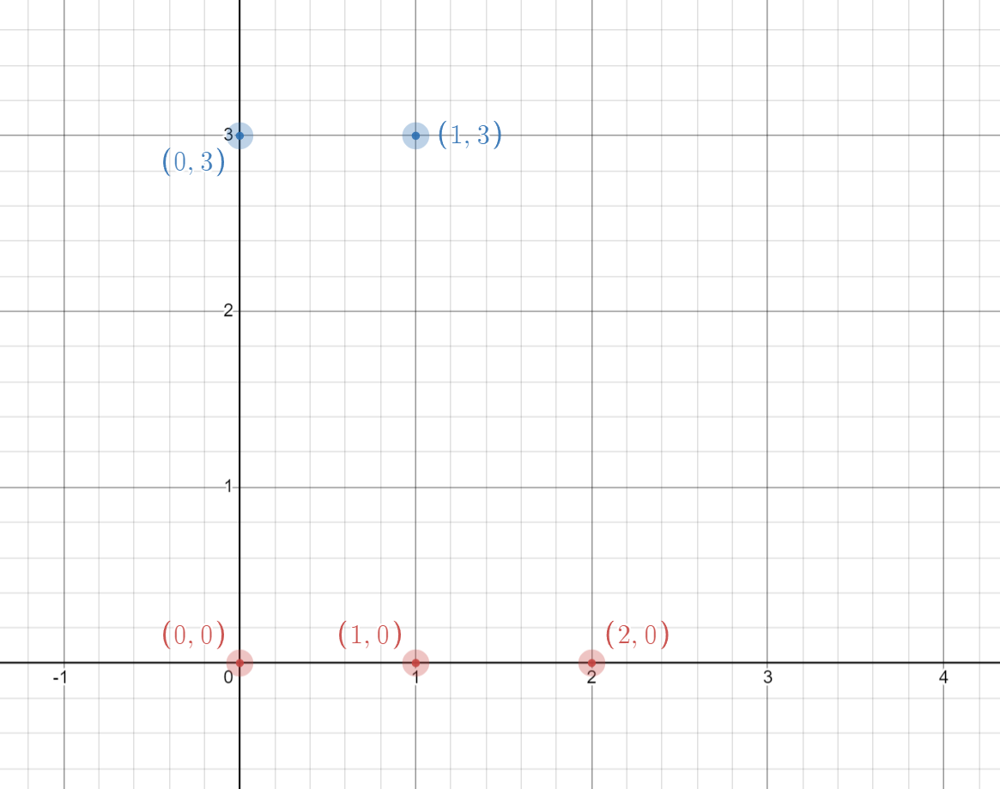
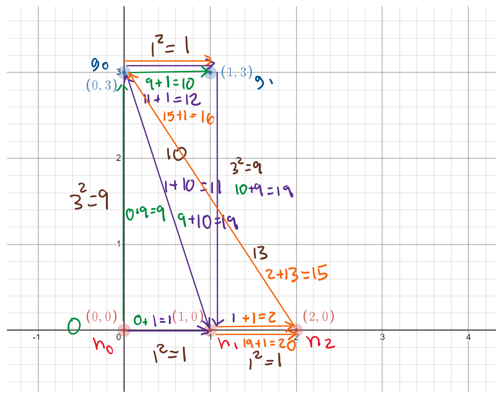

# USACO 2016 December Contest, Gold
## Problem 2. Cow Checklist

http://www.usaco.org/index.php?page=viewproblem2&cpid=670

Every day, Farmer John walks through his pasture to check on the well-being of each of his cows. On his farm he has two breeds of cows, Holsteins and Guernseys. His `H` Holsteins are conveniently numbered `1...H`, and his `G` Guernseys are conveniently numbered `1...G` `(1 <= H <= 1000, 1 <= G <= 1000)`. Each cow is located at a point in the 2D plane (not necessarily distinct).

Farmer John starts his tour at Holstein 1, and ends at Holstein `H`. He wants to visit each cow along the way, and for convenience in maintaining his checklist of cows visited so far, he wants to visit the Holsteins and Guernseys in the order in which they are numbered. In the sequence of all `H+G` cows he visits, the Holsteins numbered `1...H` should appear as a (not necessarily contiguous) subsequence, and likewise for the Guernseys. Otherwise stated, the sequence of all `H+G` cows should be formed by interleaving the list of Holsteins numbered `1...H` with the list of Guernseys numbered `1...G`.

When FJ moves from one cow to another cow traveling a distance of `D`, he expends `D^2` energy. Please help him determine the minimum amount of energy required to visit all his cows according to a tour as described above.

### Input Format (file checklist.in):

The first line of input contains `H` and `G`, separated by a space.
The next `H` lines contain the x and y coordinates of the `H` Holsteins, and the next `G` lines after that contain coordinates of the Guernseys. Each coordinate is an integer in the range `0...1000`.

### Output Format (file checklist.out):

Write a single line of output, giving the minimum energy required for FJ's tour of all the cows.

### Sample Input
```
3 2
0 0
1 0
2 0
0 3
1 3
```

### Sample Output
```
20
```

### Hints:
- The following are valid tours (not necessarily optimal):
    - `h1 -> g1 -> h2 -> g2 -> h3`
    - `h1 -> g1 -> g2 -> h2 -> h3`
    - `h1 -> h2 -> g1 -> g2 -> h3`

- **Coordinate plane**:  
    

# Solutions:

https://github.com/Reddimus/USACO_notes/tree/main/Multi-D_Dynamic_Programming/Gold/P2_2016-Cow_Checklist

### Intuition:
The problem asks for the minimum amount of energy required for Farmer John to visit all of his cows. Energy is calculated based on the squared distance between cows. The catch is that the sequence in which the cows are visited matters; he has to visit them in ascending order based on their numbering, but can switch between the two breeds.

To solve this problem, we can use dynamic programming (DP). We will have a 3D DP array, dp[h+1][g+1][2], where the first dimension is correlated to the Holsteins indices, the second dimension is correlated to the Guernseys indices, and the third dimension is correlated to the breed type (0 = Holstein, 1 = Guernsey). This structure will allow us to keep track of energy spent when going from H -> H, G -> G, and H -> G, G -> H.

### Steps:
1. Read input data
    - Read first line input: `h = Holstein num`, `g = guernseys num`
    - For the next `H` lines then next `G` lines read breed coordinates
2. Initialize 3D DP array, `dp[h+1][g+1][2]` filled with `MAX` values to solve for min dist across breeds
3. Set base case: `dp[1][0][0] = 0` (Start with 0 distance at first holstein cow)
4. Iterate through `hIdx` from 1 to `h`:
    - Iterate through `gIdx` from 0 to `g`:
        - Check neigbouring holsteins distances:
            - `dp[hIdx][gIdx][0] = min(dp[hIdx][gIdx][0], dp[hIdx-1][gIdx][0] + energy(hs[hIdx-2], hs[hIdx-1]))`
        - Check neigbouring guernseys distances:
            - `dp[hIdx][gIdx][1] = min(dp[hIdx][gIdx][1], dp[hIdx][gIdx-1][1] + energy(gs[gIdx-2], gs[gIdx-1]))`
        - Check across breeds distances:
            - `dp[hIdx][gIdx][0] = min(dp[hIdx][gIdx][0], dp[hIdx-1][gIdx][1] + energy(hs[hIdx-1], gs[gIdx-1]))`
            - `dp[hIdx][gIdx][1] = min(dp[hIdx][gIdx][1], dp[hIdx][gIdx-1][0] + energy(gs[gIdx-1], hs[hIdx-1]))`
5. Write answer to output file:
    - `dp[h][g][0]`, since answer must end with last holstein cow

### Time & Space complexity:
**Time:** `O(H*G)`  
**Space:** `O(H*G)`  

Where `H` is the number of Holsteins, and `G` is the number of Guernseys.

### C++ Code:
```cpp
#define ui unsigned int

#include <bits/stdc++.h>

using namespace std;

struct Coordinates {int x, y;};

// Find the distance between two points then square it
ui energy(const Coordinates &a, const Coordinates &b) {
	int xDist = a.x - b.x;
	int yDist = a.y - b.y;
	return (xDist * xDist) + (yDist * yDist);
}

int main() {
	freopen("checklist.in", "r", stdin);
	// Read first line input: h = Holstein num, g = guernseys num
	int h, g;
	cin >> h >> g;
	// For the next H lines then next G lines read breed coordinates
	Coordinates hs[h], gs[g];
	for (int idx = 0; idx < h; ++idx)
		cin >> hs[idx].x >> hs[idx].y;
	for (int idx = 0; idx < g; ++idx)
		cin >> gs[idx].x >> gs[idx].y;
	
	// dp[h+1][g+1][2] filled with MAX values to solve for min dist across breeds
	// where hIdx = 0 are dummy values, & gIdx = 0 are base cases/dummy values
	// Where the 3rd dimension is 0 = Holstein, 1 = Guernsey
	vector<vector<vector<ui>>> dp(h + 1, vector<vector<ui>>(g + 1, vector<ui>(2, INT_MAX)));
	dp[1][0][0] = 0;	// Base case: Start with 0 distance at first holstein cow
	for (int hIdx = 1; hIdx <= h; ++hIdx) {
		for (int gIdx = 0; gIdx <= g; ++gIdx) {
			// Check neigbouring holsteins distances
			if (hIdx > 1) {
				dp[hIdx][gIdx][0] = 
					min(dp[hIdx][gIdx][0], 
						dp[hIdx - 1][gIdx][0] + energy(hs[hIdx - 2], hs[hIdx - 1]));
			}
			// Check neigbouring guernseys distances
			if (gIdx > 1) {
				dp[hIdx][gIdx][1] = 
					min(dp[hIdx][gIdx][1], 
						dp[hIdx][gIdx - 1][1] + energy(gs[gIdx - 2], gs[gIdx - 1]));
			}
			// Check across breeds distances
			if (hIdx > 0 && gIdx > 0) {
				ui crossEnergy = energy(hs[hIdx - 1], gs[gIdx - 1]);
				dp[hIdx][gIdx][0] = 
					min(dp[hIdx][gIdx][0], dp[hIdx - 1][gIdx][1] + crossEnergy);
				dp[hIdx][gIdx][1] = 
					min(dp[hIdx][gIdx][1], dp[hIdx][gIdx - 1][0] + crossEnergy);
			}
		}
	}

    // Answer must end with last holstein cow
	freopen("checklist.out", "w", stdout);
	cout << dp[h][g][0] << endl;
}
```

### Java Code:
```java
import java.io.*;
import java.util.*;

public class CowChecklist {
	static class Coordinates {
		final int x, y;
		Coordinates(int x, int y) {
			this.x = x;
			this.y = y;
		}
	}

	// Find the distance between two points then square it
	private static final long energy(final Coordinates a, final Coordinates b) {
		final int xDist = a.x - b.x, yDist = a.y - b.y;
		return (xDist * xDist) + (yDist * yDist);
	}

	public static void main(String[] args) throws IOException {
		BufferedReader in = new BufferedReader(new FileReader("checklist.in"));
		// Read first line input: h = Holstein num, g = guernseys num
		StringTokenizer st = new StringTokenizer(in.readLine());
		int h = Integer.parseInt(st.nextToken());
		int g = Integer.parseInt(st.nextToken());
		// For the next H lines then next G lines read breed coordinates
		Coordinates hs[] = new Coordinates[h];
		for (int idx = 0; idx < h; ++idx){
			st = new StringTokenizer(in.readLine());
			int x = Integer.parseInt(st.nextToken());
			int y = Integer.parseInt(st.nextToken());
			hs[idx] = new Coordinates(x, y);
		}
		Coordinates gs[] = new Coordinates[g];
		for (int idx = 0; idx < g; ++idx){
			st = new StringTokenizer(in.readLine());
			int x = Integer.parseInt(st.nextToken());
			int y = Integer.parseInt(st.nextToken());
			gs[idx] = new Coordinates(x, y);
		}
		in.close();

		// dp[h+1][g+1][2] filled with MAX values to solve for min dist across breeds
		// where hIdx = 0 are dummy values, & gIdx = 0 are base cases/dummy values
		// Where the 3rd dimension is 0 = Holstein, 1 = Guernsey
		long dp[][][] = new long[h+1][g+1][2];
		for (long[][] hArr : dp) {
			for (long[] gArr : hArr) {
				Arrays.fill(gArr, Integer.MAX_VALUE);
			}
		}
		dp[1][0][0] = 0;	// Base case: Start with 0 distance at first holstein cow
		for (int hIdx = 1; hIdx <= h; ++hIdx) {
			for (int gIdx = 0; gIdx <= g; ++gIdx) {
				// Check neigbouring holsteins distances
				if (1 < hIdx) {
					dp[hIdx][gIdx][0] = 
						Math.min(dp[hIdx][gIdx][0], 
								dp[hIdx-1][gIdx][0] + energy(hs[hIdx-2], hs[hIdx-1]));
				}
				// Check neigbouring guernseys distances
				if (1 < gIdx) {
					dp[hIdx][gIdx][1] = 
						Math.min(dp[hIdx][gIdx][1], 
								dp[hIdx][gIdx-1][1] + energy(gs[gIdx-2], gs[gIdx-1]));
				}
				// Check across breeds distances
				if (0 < hIdx && 0 < gIdx) {
					final long crossEnergy = energy(hs[hIdx-1], gs[gIdx-1]);
					dp[hIdx][gIdx][0] = 
						Math.min(dp[hIdx][gIdx][0], dp[hIdx-1][gIdx][1] + crossEnergy);
					dp[hIdx][gIdx][1] = 
						Math.min(dp[hIdx][gIdx][1], dp[hIdx][gIdx-1][0] + crossEnergy);
				}
			}
		}

		// Answer must end with last holstein cow
		PrintWriter out = new PrintWriter("checklist.out");
		out.println(dp[h][g][0]);
		out.close();
	}
}
```

### Step by step whiteboarding:

**Gathered sample input data**:  
`H = 3`, `G = 2`  
`Holsteins = [h0, h1, h2] = [(0,0), (1,0), (2,0)]`  
`Guernseys = [g0, g1] = [(0,3), (1,3)]`

**3-D DP sample input/output iteration grid**:

**Iteration 1 (no change/base case):**
|   **dp**  |    Dummy   |   gIdx0    |   gIdx1    |
|:---------:|:----------:|:----------:|:----------:|
| **Dummy** | [INF, INF] | [INF, INF] | [INF, INF] |
| **hIdx0** | [0, INF]   | [INF, INF] | [INF, INF] |
| **hIdx1** | [INF, INF] | [INF, INF] | [INF, INF] |
| **hIdx2** | [INF, INF] | [INF, INF] | [INF, INF] |


**Iteration 2:**  
*Check across breed distances:*  
dp[hIdx0][gIdx0][1] = min(dp[hIdx0][gIdx0][1], `dp[hIdx0][gIdx0][0]` + dist(`h0 point`, `g0 point`)^2)  
                    = min(INF, `0` + dist(`(0,0)`, `(0,3)`)^2)  
                    = min(INF, (3)^2)  
                    = min(INF, 9)  

`dp[h0][g1][1] = 9`

|   **dp**  |    Dummy   |   gIdx0    |   gIdx1    |
|:---------:|:----------:|:----------:|:----------:|
| **Dummy** | [INF, INF] | [INF, INF] | [INF, INF] |
| **hIdx0** | [`0`, INF] | [INF, `9`] | [INF, INF] |
| **hIdx1** | [INF, INF] | [INF, INF] | [INF, INF] |
| **hIdx2** | [INF, INF] | [INF, INF] | [INF, INF] |

**Iteration 3:**  
*Check neigbouring guernsey distances:*  
dp[hIdx0][gIdx1][1] = min(dp[hIdx0][gIdx1][1], `dp[hIdx0][gIdx0][1]` + dist(`g0 point`, `g1 point`)^2)  
                    = min(INF, `9` + dist(`(0,3)`, `(1,3)`)^2)  
                    = min(INF, `9` + (1)^2)  
                    = min(INF, 10)  
                    = 10

*Check across breed distances:*  
dp[hIdx0][gIdx1][1] = min(dp[hIdx0][gIdx1][1], `dp[hIdx0][gIdx0][0]` + dist(`h0 point`, `g1 point`)^2)  
                    = min(10, `INF` + dist(`(0,0)`, `(1,3)`)^2)  
                    = min(10, `INF`)  
                    = 10

`dp[h0][g2][1] = 10`

|   **dp**  |    Dummy   |   gIdx0    |   gIdx1    |
|:---------:|:----------:|:----------:|:----------:|
| **Dummy** | [INF, INF] | [INF, INF] | [INF, INF] |
| **hIdx0** | [0, INF] | [`INF`, `9`] | [INF, `10`] |
| **hIdx1** | [INF, INF] | [INF, INF] | [INF, INF] |
| **hIdx2** | [INF, INF] | [INF, INF] | [INF, INF] |

**Iteration 4:**  
*Check neigbouring holsteins distances:*  
dp[hIdx1][Dummy][0] = min(dp[hIdx1][Dummy][0], `dp[hIdx0][Dummy][0]` + dist(`h0 point`, `h1 point`)^2)  
                    = min(INF, `0` + dist(`(0,0)`, `(1,0)`)^2)  
                    = min(INF, (1)^2)  
                    = min(INF, 1)

`dp[hIdx1][gIdx0][0] = 1`

|   **dp**  |    Dummy   |   gIdx0    |   gIdx1    |
|:---------:|:----------:|:----------:|:----------:|
| **Dummy** | [INF, INF] | [INF, INF] | [INF, INF] |
| **hIdx0** | [`0`, INF] | [INF, 9]   | [INF, 10]  |
| **hIdx1** | [`1`, INF] | [INF, INF] | [INF, INF] |
| **hIdx2** | [INF, INF] | [INF, INF] | [INF, INF] |

**Iteration 5:**  
*Check across breed distances:*  

dp[hIdx1][gIdx0][0] = min(dp[hIdx1][gIdx0][0], `dp[hIdx0][gIdx0][1]` + dist(`h1 point`, `g0 point`)^2)  
                    = min(INF, `9` + dist(`(1,0)`, `(0,3)`)^2)  
                    = min(INF, `9` + ((1-0)^2 + (3-0)^2))  
                    = min(INF, 9 + 10)  
                    = min(INF, 19)  
`dp[hIdx1][gIdx0][0] = 19`  

dp[hIdx1][gIdx0][1] = min(dp[hIdx1][gIdx0][1], `dp[hIdx1][dummy][0]` + dist(`h1 point`, `g0 point`)^2)  
                    = min(INF, `1` + 10)  
                    = min(INF, 11)  
`dp[hIdx1][gIdx0][1] = 11`

|   **dp**  |    Dummy   |   gIdx0    |   gIdx1    |
|:---------:|:----------:|:----------:|:----------:|
| **Dummy** | [INF, INF] | [INF, INF] | [INF, INF] |
| **hIdx0** | [0, INF]   | [INF, `9`] | [INF, 10]  |
| **hIdx1** | [`1`, INF] | [`19`, `11`] | [INF, INF] |
| **hIdx2** | [INF, INF] | [INF, INF] | [INF, INF] |

**Iteration 6:**  
*Check neigbouring guernseys distances:*  
dp[hIdx1][gIdx1][1] = min(dp[hIdx1][gIdx1][1], `dp[hIdx1][gIdx0][1]` + dist(`g0 point`, `g1 point`)^2)  
                    = min(INF, `11` + dist(`(0,3)`, `(1,3)`)^2)  
                    = min(INF, `11` + (1)^2)  
                    = min(INF, 12)
`dp[hIdx1][gIdx1][1] = 12`

*Check across breed distances:*  
dp[hIdx1][gIdx1][0] = min(dp[hIdx1][gIdx1][0], `dp[hIdx0][gIdx1][1]` + dist(`h1 point`, `g1 point`)^2)  
                    = min(INF, `10` + dist(`(1,0)`, `(1,3)`)^2)  
                    = min(INF, `10` + (3)^2)  
                    = min(INF, `10` + 9)
                    = min(INF, 19)  
`dp[hIdx1][gIdx1][0] = 19`  

dp[hIdx1][gIdx1][1] = min(dp[hIdx1][gIdx1][1], `dp[hIdx1][gIdx0][0]` + dist(`h1 point`, `g1 point`)^2)  
                    = min(12, `19` + 9)
                    = min(12, 28)  
                    = 12

|   **dp**  |    Dummy   |   gIdx0    |   gIdx1    |
|:---------:|:----------:|:----------:|:----------:|
| **Dummy** | [INF, INF] | [INF, INF] | [INF, INF] |
| **hIdx0** | [0, INF]   | [INF, 9]   | [INF, `10`]  |
| **hIdx1** | [1, INF]   | [`19`, `11`] | [`19`, `12`] |
| **hIdx2** | [INF, INF] | [INF, INF] | [INF, INF] |

**Iteration 7:**  
*Check neigbouring holsteins distances:*  
dp[hIdx2][Dummy][0] = min(dp[hIdx2][Dummy][0], `dp[hIdx1][Dummy][0]` + dist(`h1 point`, `h2 point`)^2)  
                    = min(INF, `1` + dist(`(1,0)`, `(2,0)`)^2)  
                    = min(INF, `1` + (1)^2)  
                    = min(INF, 2)  
`dp[hIdx2][Dummy][0] = 2`

|   **dp**  |    Dummy   |   gIdx0    |   gIdx1    |
|:---------:|:----------:|:----------:|:----------:|
| **Dummy** | [INF, INF] | [INF, INF] | [INF, INF] |
| **hIdx0** | [0, INF]   | [INF, 9]   | [INF, 10]  |
| **hIdx1** | [1, INF]   | [19, 11]   | [19, 12]   |
| **hIdx2** | [`2`, INF] | [INF, INF] | [INF, INF] |


**Iteration 8:**  
*Check neigbouring holsteins distances:*  
dp[hIdx2][gIdx0][0] = min(dp[hIdx2][gIdx0][0], `dp[hIdx1][gIdx0][0]` + dist(`h1 point`, `h2 point`)^2)  
                    = min(INF, `19` + dist(`(1,0)`, `(2,0)`)^2)  
                    = min(INF, `19` + (1)^2)  
                    = min(INF, 20)  
`dp[hIdx2][gIdx0][0] = 20`  

*Check across breed distances:*
dp[hIdx2][gIdx0][0] = min(dp[hIdx2][gIdx0][0], `dp[hIdx1][gIdx0][1]` + dist(`h2 point`, `g0 point`)^2)  
                    = min(20, `11` + dist(`(2,0)`, `(0,3)`)^2)  
                    = min(20, `11` + ((2-0)^2 + (3-0)^2))  
                    = min(20, 11 + 13)  
                    = min(20, 24)  
                    = 20  


dp[hIdx2][gIdx0][1] = min(dp[hIdx2][gIdx0][1], `dp[hIdx2][Dummy][0]` + dist(`h2 point`, `g0 point`)^2)  
                    = min(INF, `2` + 13)
                    = min(INF, 15)
`dp[hIdx2][gIdx0][1] = 15`


|   **dp**  |    Dummy   |   gIdx0    |   gIdx1    |
|:---------:|:----------:|:----------:|:----------:|
| **Dummy** | [INF, INF] | [INF, INF] | [INF, INF] |
| **hIdx0** | [0, INF]   | [INF, 9]   | [INF, 10]  |
| **hIdx1** | [1, INF]   | [`19`, `11`] | [19, 12]   |
| **hIdx2** | [`2`, INF]   | [`20`, `15`] | [INF, INF] |


**Iteration 9:**  
*Check neigbouring holsteins distances:*  
dp[hIdx2][gIdx1][0] = min(dp[hIdx2][gIdx1][0], `dp[hIdx1][gIdx1][0]` + dist(`h1 point`, `h2 point`)^2)
                    = min(INF, `19` + dist(`(1,0)`, `(2,0)`)^2)  
                    = min(INF, `19` + (1)^2)  
                    = min(INF, 20)
`dp[hIdx2][gIdx1][0] = 20`

*Check neigbouring guernseys distances:*  
dp[hIdx2][gIdx1][1] = min(dp[hIdx2][gIdx1][1], `dp[hIdx2][gIdx0][1]` + dist(`g0 point`, `g1 point`)^2)  
                    = min(INF, `15` + dist(`(0,3)`, `(1,3)`)^2)  
                    = min(INF, `15` + (1)^2)  
                    = min(INF, 16)  
`dp[hIdx2][gIdx1][1] = 16`  

*Check across breed distances:*  
dp[hIdx2][gIdx1][0] = min(dp[hIdx2][gIdx1][0], `dp[hIdx1][gIdx1][1]` + dist(`h2 point`, `g1 point`)^2)  
                    = min(20, `12` + dist(`(2,0)`, `(1,3)`)^2)  
                    = min(20, `12` + ((2-1)^2 + (3-0)^2))  
                    = min(20, 12 + 10)  
                    = min(20, 22)  
                    = 20  

dp[hIdx2][gIdx1][1] = min(dp[hIdx2][gIdx1][1], `dp[hIdx2][gIdx0][0]` + dist(`h2 point`, `g1 point`)^2)  
                    = min(16, `20` + 10)  
                    = min(16, 30)  
                    = 16

|   **dp**  |    Dummy   |   gIdx0    |   gIdx1    |
|:---------:|:----------:|:----------:|:----------:|
| **Dummy** | [INF, INF] | [INF, INF] | [INF, INF] |
| **hIdx0** | [0, INF]   | [INF, 9]   | [INF, 10]  |
| **hIdx1** | [1, INF]   | [19, 11]   | [`19`, `12`] |
| **hIdx2** | [2, INF]   | [`20`, `15`] | [`20`, `16`] |

### Whiteboard coordinate plane with saved min DP values:

